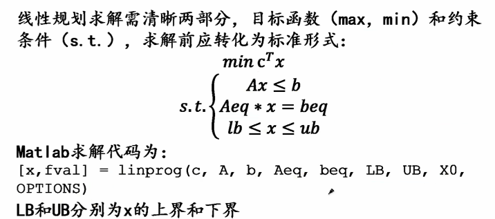
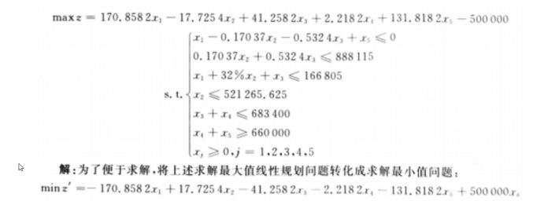
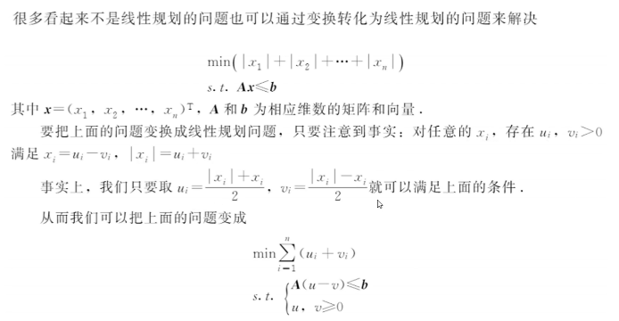
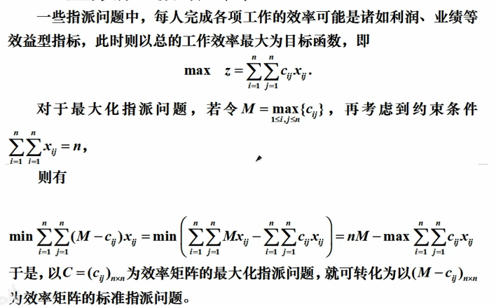
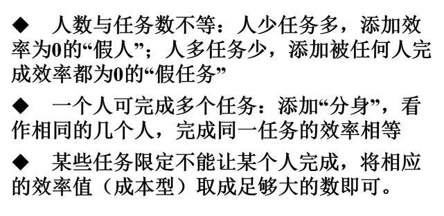
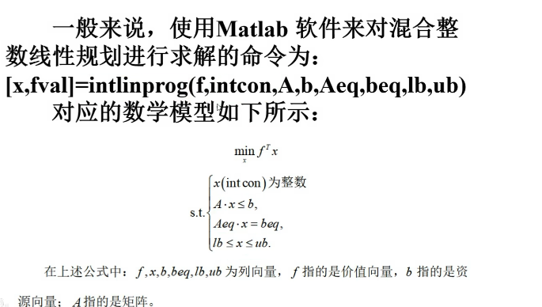
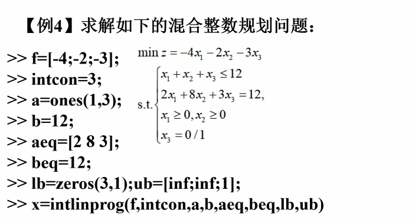

# 线性规划&整数规划
## 线性规划
1. 什么是线性规划  
>目标函数与约束条件都是线性的。  
2. 标准形式  
  
x0是初值，options，这俩直接放[]。  
3. 例子  
  
增加变量x6，增加约束条件x6 = 1。  
4. 线性规划转化  
  
***
## 整数规划  
>变量限制为整数的方法，分为纯整数和混合线性规划(部分变量限制为整数)。
1. 广义指派问题化为标准形式：  
i. 最大化指派问题
  
将`最大化`转换为`与最大值距离最小`问题。  
ii. 人数与任务数不等& 一个人可完成多个任务&某人不能完成某任务  
  
最终化为一人做一个任务，且人数与任务数相等。  
2. 整数规划求解  
  
例：  
  
