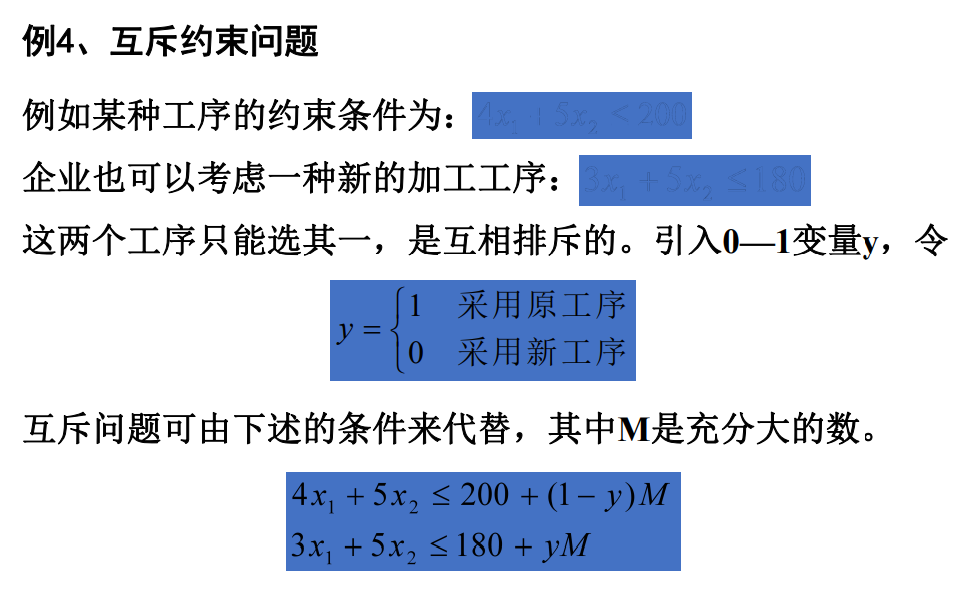

## 匈牙利算法  
1. 例题：0-1变量的使用  
  
选择是否投资，即将Xi赋值0或1。 
2. 互斥约束的推广  
  
注意其中M是无穷大。前看不清的两式为下方两式。  
  
给不选择的约束条件加上一个很大的数。  
3. 固定费用问题  
  
xi是每种物品的产量，yi是0-1变量，M是无穷大。不选择生产线时，约束条件i使得xi只能为0。  
4. 指派问题  
  
指派问题标准形式：  
  
数学模型：  
  
匈牙利解法一般步骤：  
每行找最小值减，使得每行至少出现一个0；而后给只有一个0的行中的那个0加圈，划去该加圈0所在列的其他0元素，代表已经指派。反复直到尽可能多的0被加圈和划掉。若仍有没画圈的0，且同行0至少有两个，则从剩余0元素最少的行开始，比较各0所在列中0元素数，选择最少的0加圈，即礼让。反复直到所有0加圈或划掉。若加圈0数等于矩阵阶数，即找到最优解。  
若圈0数小于矩阵阶数，以下步骤：  
  
###  实例过程展示  
  
  
  
  
***  
>总结：Matlab中匈牙利算法需自己求出指派矩阵再用linprog求解，python中使用scipy.optimize中的linear_sum_assignment函数可求出指派矩阵。  
整数规划也可用专门软件Lingo。
