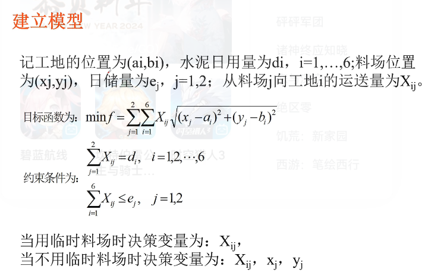

## 非线性规划  
>目标函数、约束条件中含有非线性函数。  
求解：  
  
  
例题：  
  
  
***
## 二次规划  
>目标函数是自变量的二次函数，而约束条件全是线性的。  

  
注： 实对称矩阵值关于对角线对称。  
#### MATLAB求解：  
  
>注意：  
1. 一定要按照MATLAB中的标准形式输入，即二次项的前面有1/2，所以输入时H要乘2，且一次项系数矩阵f输入后会被转置，需考虑(见下例子)。  

#### 例子：  
  
>需要知识：如何根据二次型(二次式子)求出其实对称矩阵。  

#### 题目  
>建模： i代表工地，有6个值；j代表料场，有两个值。  
  
  
  
  
a,b,d是工厂位置和需求量；x,y是临时料场位置，e是临时料场的储量。  
##### 第一问：  
  
>A是不等约束，即每个工地从相应料场获取的料不能超过其储备的20吨。等式约束Aeq有六行，分别代表X11+X21等，即每个工地从两个料场运到其的料等于其需求量。VLB是下限。用线性规划求出第一问。  
  
##### 第二问：  
  
新增4个变量(料场的四个坐标)：  
  
代码：  
  
>其中，liaoch(x)是目标函数。  
  
  
约束都是线性的，只有目标函数是非线性。  
结果：105.几。
