## 层次分析法  
>方法特点：对复杂的决策问题的本质、影响因素及其内在关系等进行深入分析的基础上，利用较少的定量信息使决策的思维过程数学化。从而为多目标、多准则或无结构特性的复杂决策问题提供简便的决策方法。对于难于完全定量的复杂系统作出决策的模型和方法。  
***  
### 概述  
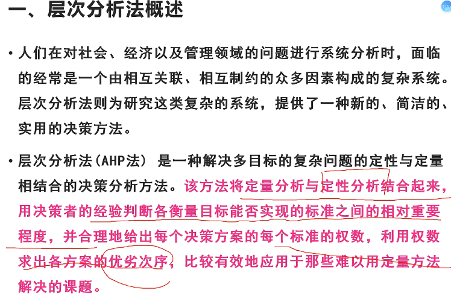  
层次化：目标层、准则层、方案层。数量化：各个指标间相对重要程度。
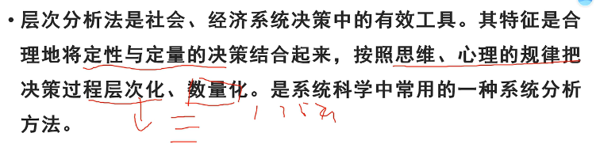  
典型应用场景：1.最佳方案选取；2.评价类问题(水质、环境等)；3.指标体系的优选(对指标进行优化，指标体系需兼顾科学和效率)。  
***  
### 基本原理  
> 1. 层次分析法根据问题的性质和要达到的总目标，将问题分解为不同的组成因素，并按照因素间的相互关联影响以及隶属关系将因素按不同层次聚集组合，形成一个多层次的分析结构模型。从而最终将问题归结为最低层(供决策的方案、措施等)相对于最高层(总目标)的相对重要权值的确定或相对优劣次序的排定。  
***  
### 层次分析法的步骤和方法  
1. 大致分为以下四个步骤：  
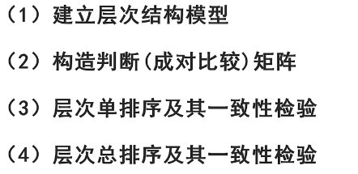  
#### 第一步 建立层次结构模型  
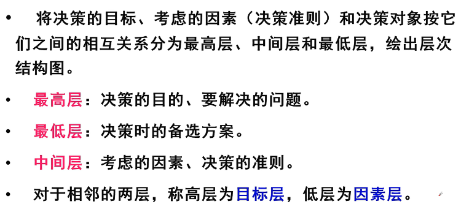  
例子：  
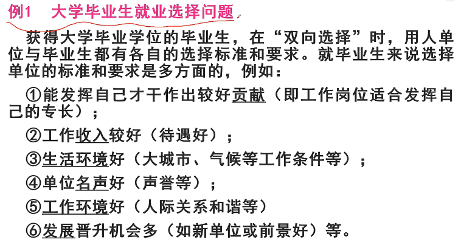  
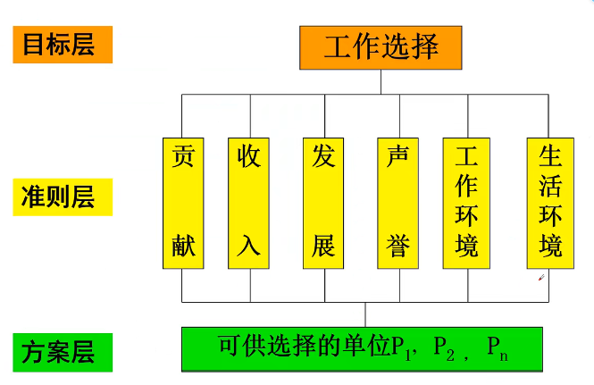  
#### 第二步 构造判断(成对比较)矩阵  
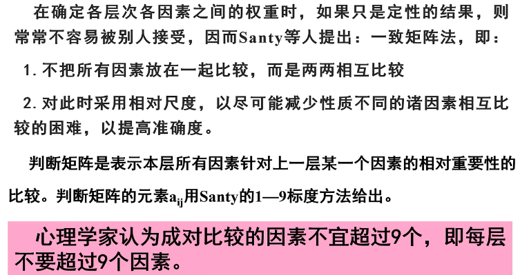  
判断矩阵元素aij的标度方法：  
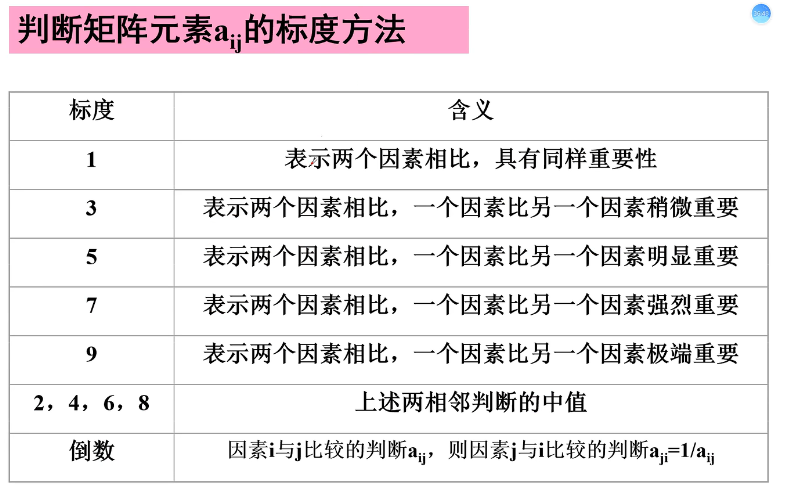  
例子：  
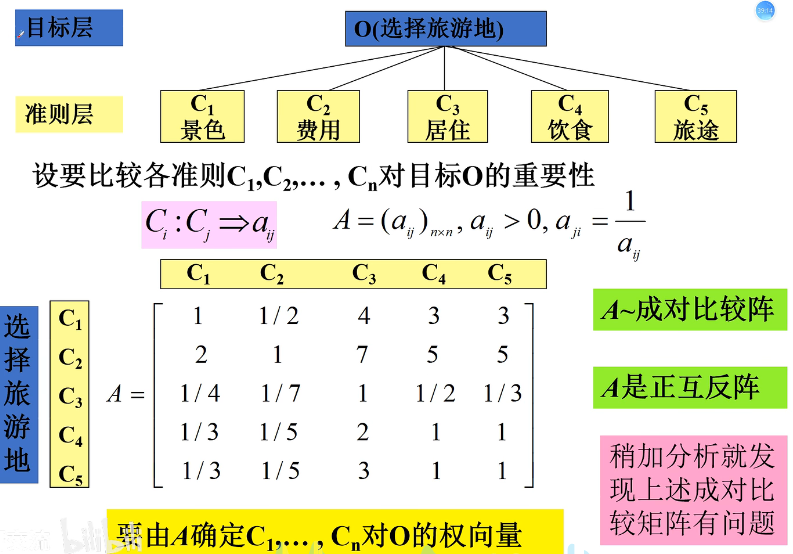  
1. 一致性：aij*ajk = aik。允许不一致，但需要确定不一致的允许范围。  
2. 一致阵的性质：A的秩为1，A的唯一非零特征根为n。非零特征根n所对应的特征向量归一化后可作为权向量。
3. 对于不一致但在允许范围内的成对比较阵B，其权向量w对应于最大特征根λ的特征向量。  
>注：向量的极大线性无关组等价于原向量、向量的秩是向量极大线性无关组的个数。  
特征值&特征向量：设A是n阶矩阵，若n维向量α不是零向量，且Aα与α线性相关，就称α为A的特征向量。此时，存在唯一数λ使得Aα = λα，称λ为α的特征值。简言之：特征向量是，在矩阵A的作用下，只做拉伸和缩小的向量。  
最大特征根是方阵特征值中最大的那个。向量归一化：`[(x)-xmin]/(xmax-xmin)`,使得向量各元素和为1。  
***  
### 层次分析法一致性检验方法  
#### 第三步 层次单排序及其一致性检验  
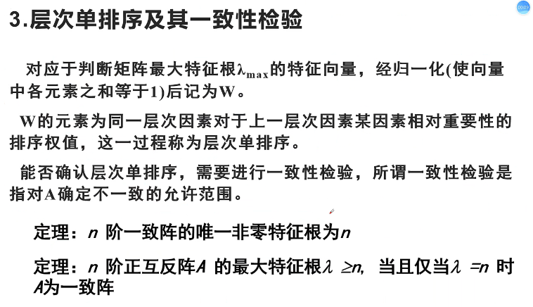  
注：互反阵也称逆矩阵，AB=BA=I，I为单位矩阵(方阵，对角线全1，余全0)，B是A的互反阵。  
例子：  
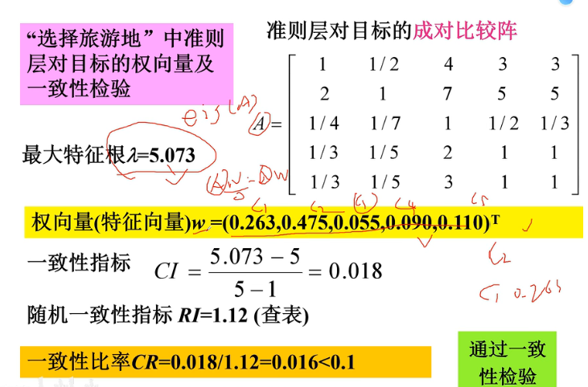
CI:  
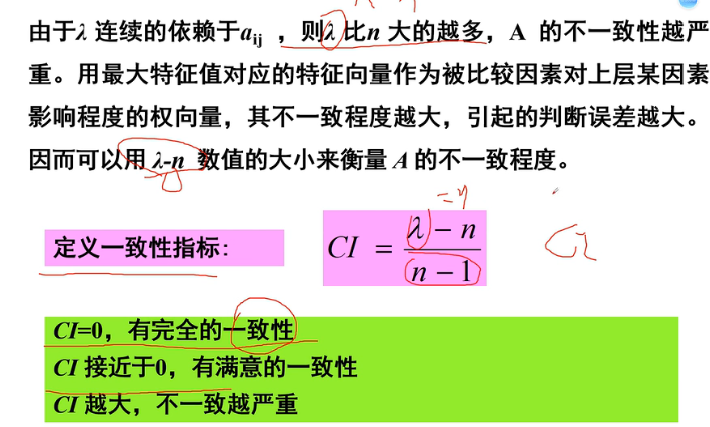  
RI:  
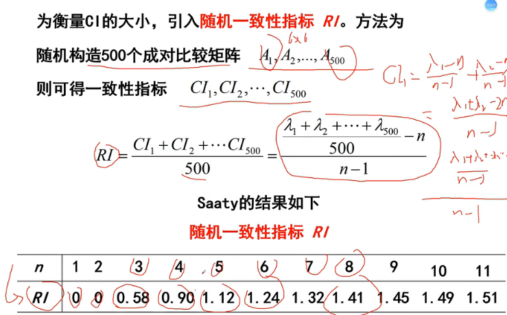  
简化算法：  
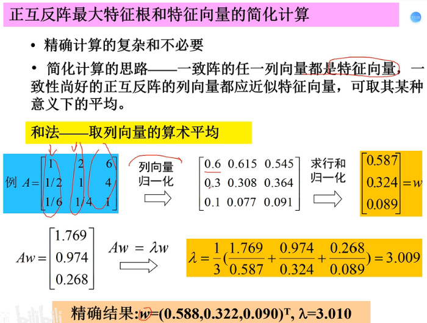  
#### 第四步 层次总排序及其一致性检验
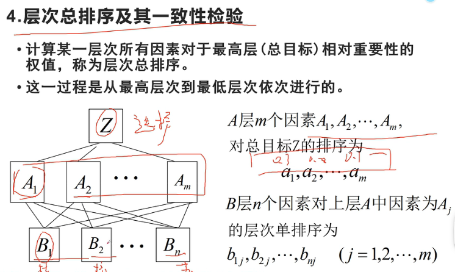  
所有的A对Z有个总排序，而每个A对所有的Bi都有一个判断矩阵。  
对B层的总排序为：  
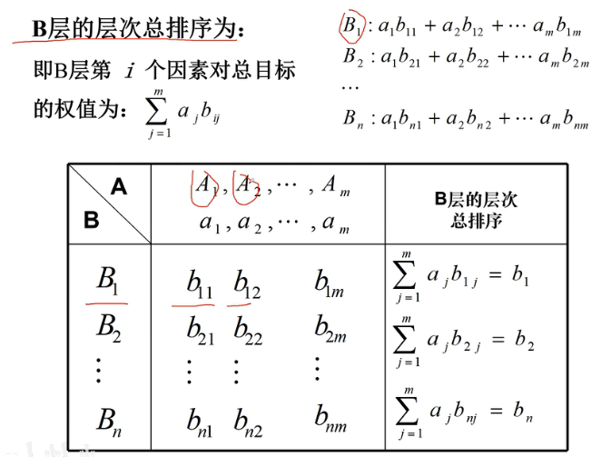  
层次总排序的一致性检验：  
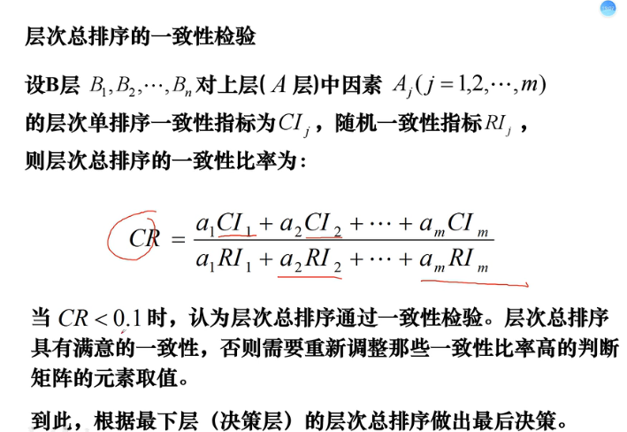  
将A对Z的权重乘以B对A的层次单排序权值，求和除以对应的RI得到总的CR，做一致性检验。  
例子：  
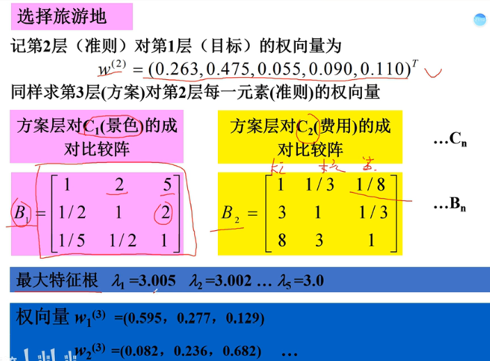  
判断矩阵-最大特征根-权向量：得到每个B对所有C的权重。  
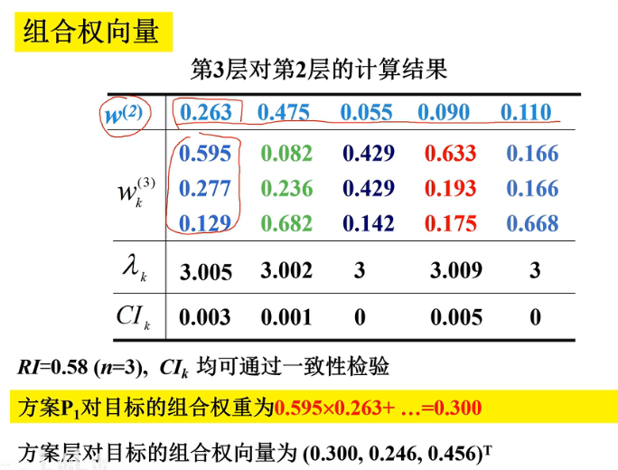  
w(2)是第二层(即准则层)对总目标层的权重，wk(3)是方案层对每个第二层的对应权重。下面是组合权向量的计算：对wk(3)的每一行，逐个与w(2)权重相乘求和，得到结果组合为方案层对目标层的组合权向量。  
### 总结  
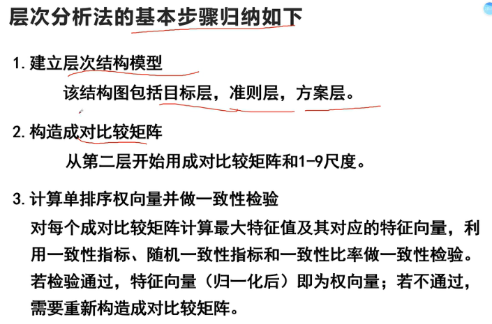  
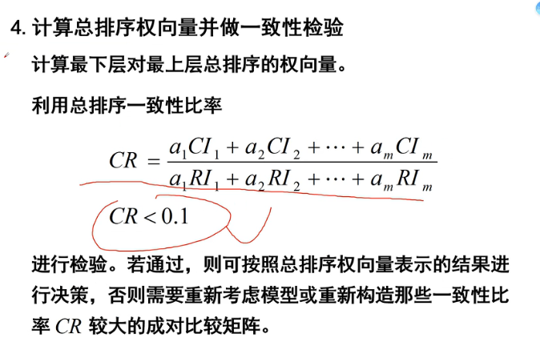  
注意！  
计算出判断矩阵的最大特征值一定要进行一致性检验！！  
综合过程如下：  
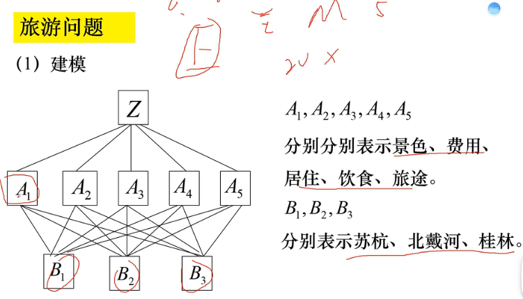  
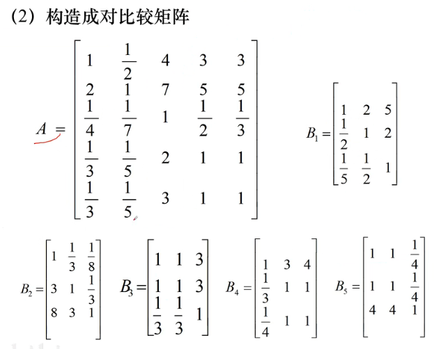  
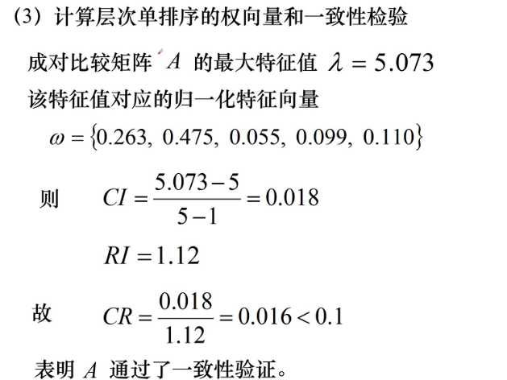  
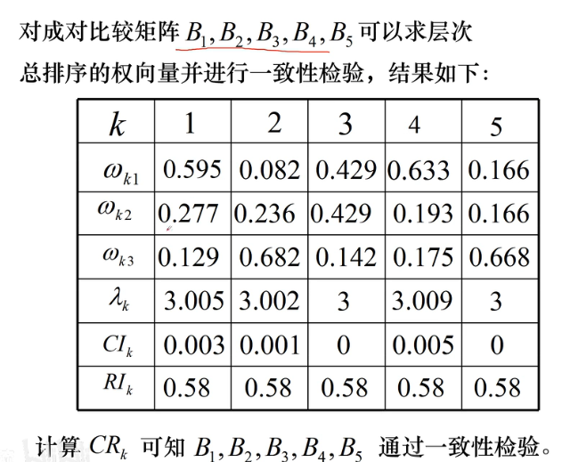  
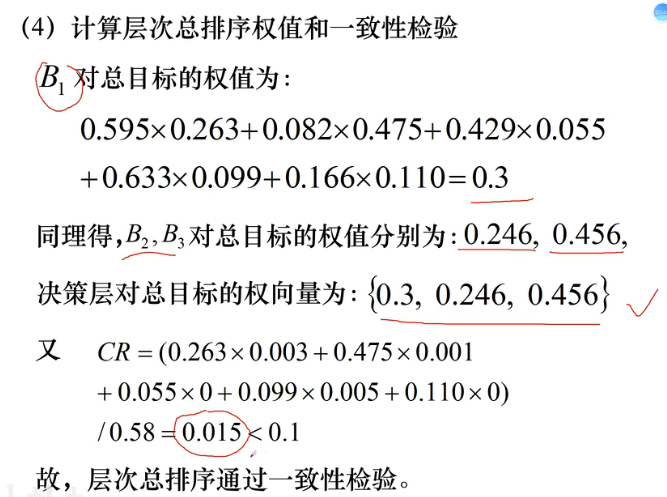  
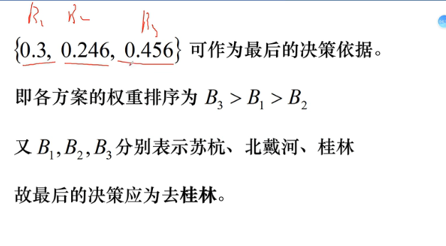  

