### TOPSIS模型  
1. 评价类方法大体分为主观赋权法和客观赋权。  
主观赋权：综合指数法，模糊综合评判法，层次分析法，功效系数法。采取综合咨询评分确定权重。  
客观赋权：成分分析法，因子分析法，理想解法(即TOPSIS法)。根据指标间相关关系或各指标值变异程度确定权重。  
2. TOPSIS  
该方法通过构造评价问题的正理想解和负理想解，即各指标的最优解和最劣解，通过计算每个方案到理想方案的相对贴进度，即靠近正理想解和远离负理想解的程度，来对方案进行排序，从而选出最优方案。  
#### 方法、原理  
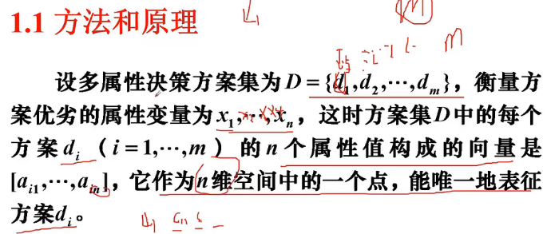  
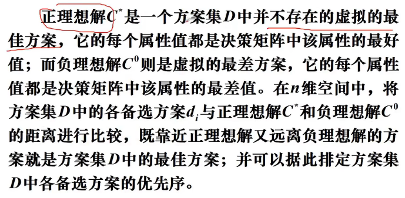  
注意是每个属性都是最好/差的。  
#### 步骤  
1. 首先需要规范、非量纲、归一化，使得计算距离时不出错。  
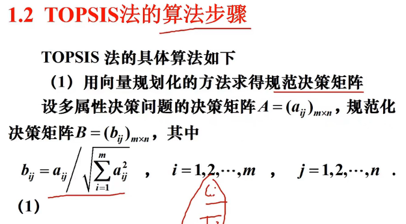  
2. 加权  
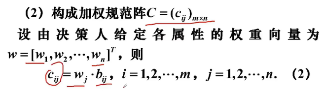  
3. 确定正理想解和负理想解  
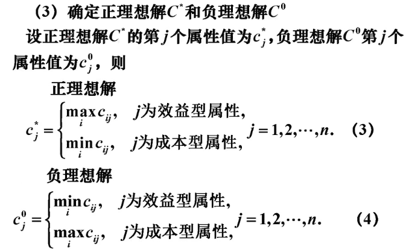  
4. 计算各方案到正负理想解的距离,得到排队指标，由大到小排序  
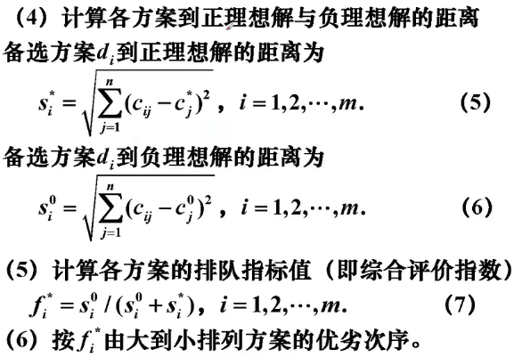    
#### 总结  
1. 规范化(变换后任一属性下，值越大越优)  
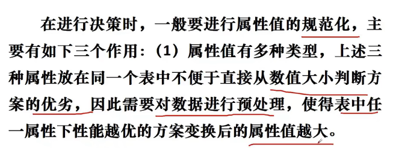  
2. 非量纲化、归一化  
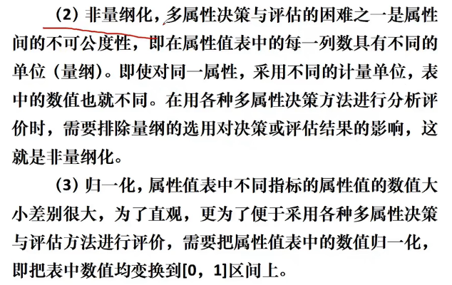  
#### 常见属性规范化方法：  
+ 线性变换  
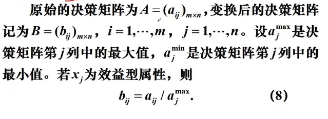  
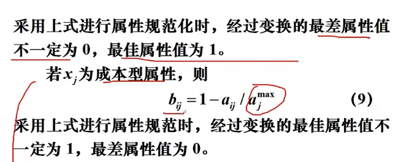  
+ 标准0-1变换  
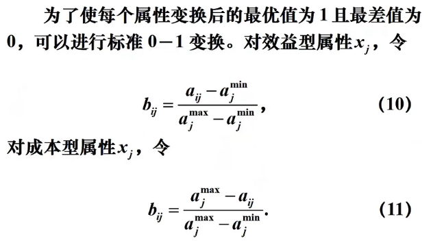  
+ 区间型属性变换(比如前例子中师生比就是区间型属性，不能太大也不能太小)  
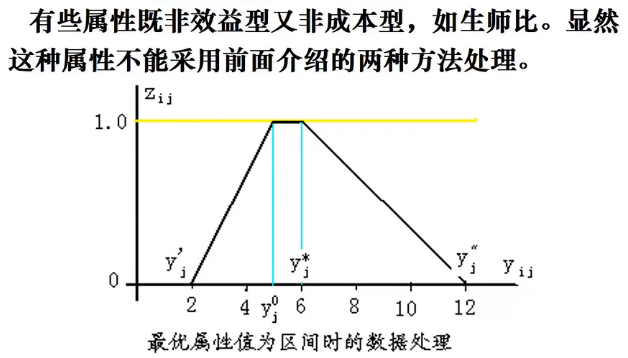  
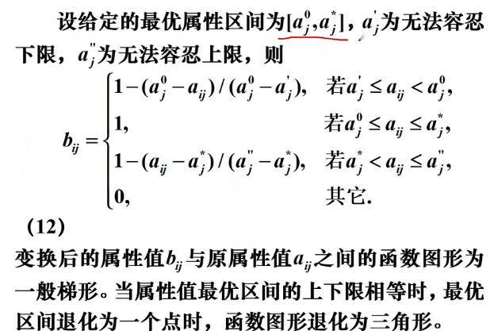  
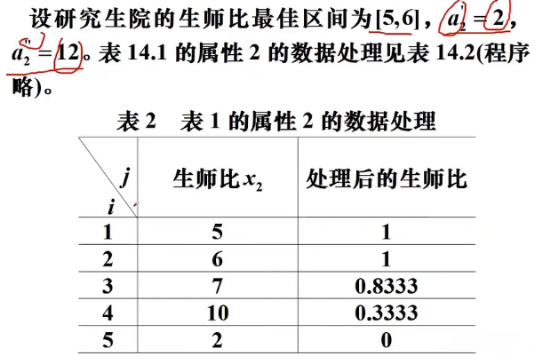  
+ 向量规范化(最常用)  
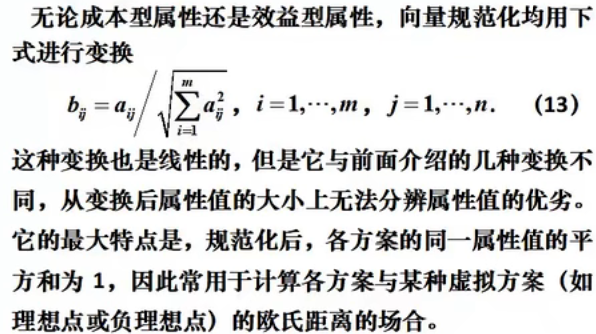  
MATLAB指令:a(:,j)/norm(a(:,j))  
+ 标准化处理  
消除变量量纲效应。只需MATLAB函数zscore(x)。比如：  
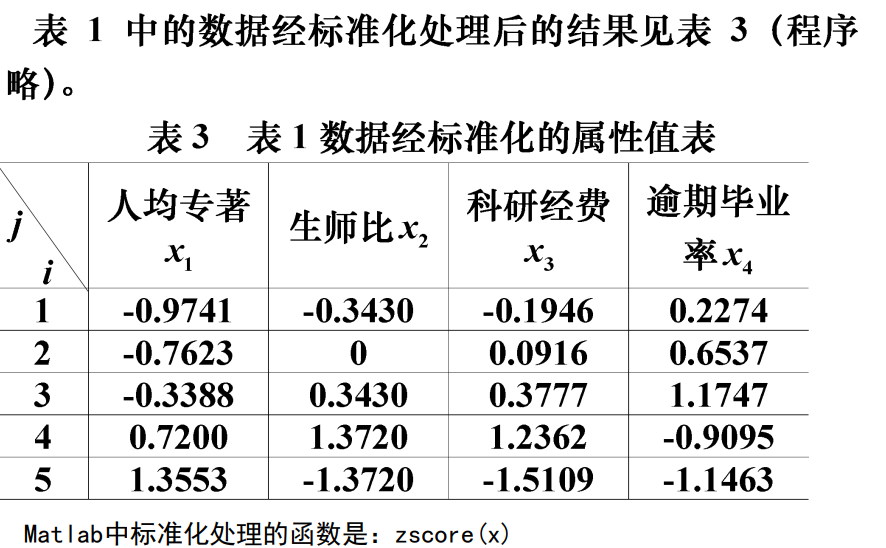  
### 综合实例  
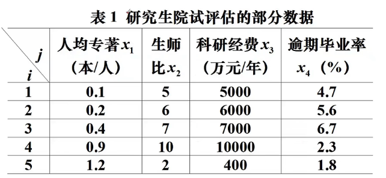  
1. 向量规范化  
代码：
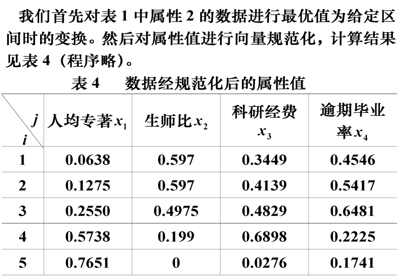  
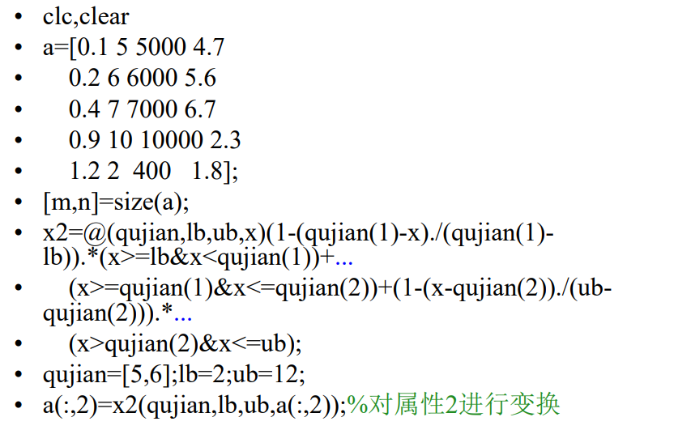  
2. 加权  
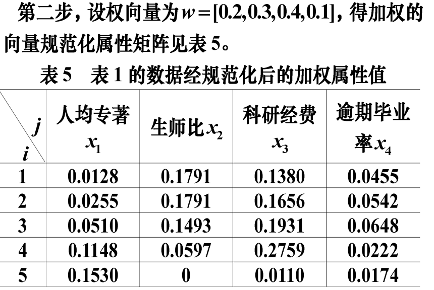  
代码：
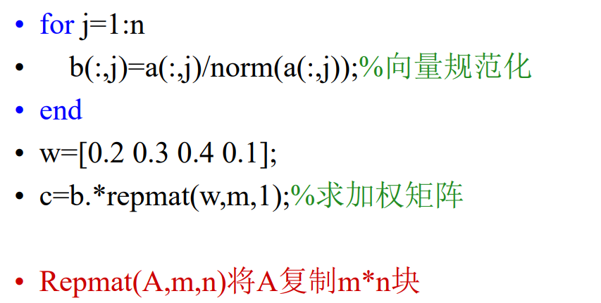  
3. 求正理想解、负理想解(注意，由于前面规范化没有处理成本型属性，所以在这里将成本型和效益型分开处理)  
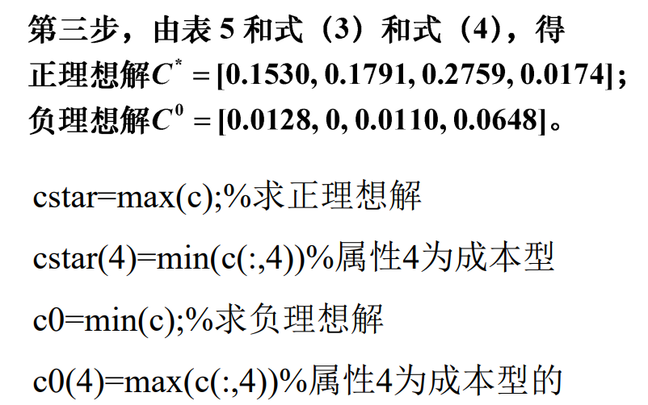  
4. 求距离并得到排序子f  
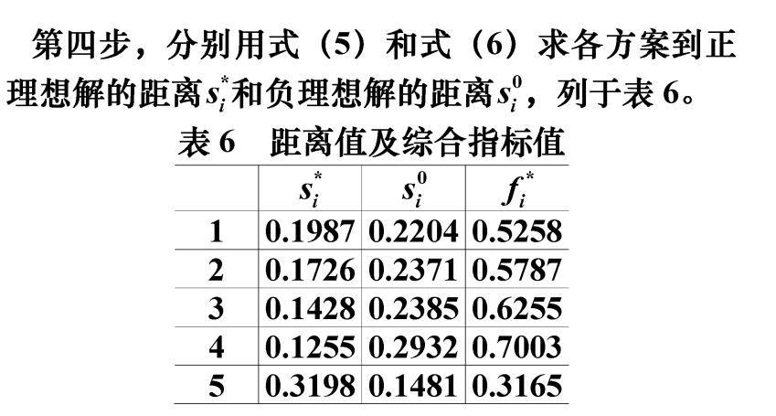  
5. 根据排序子排序  
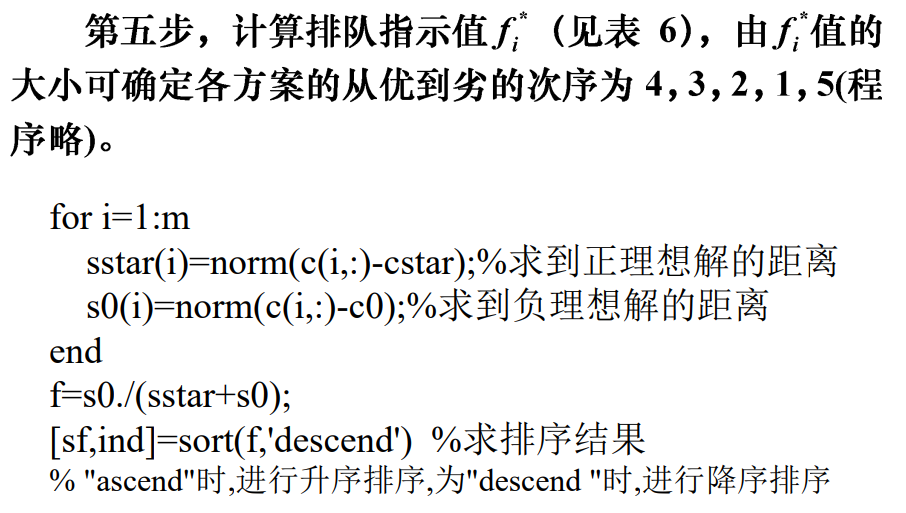  

