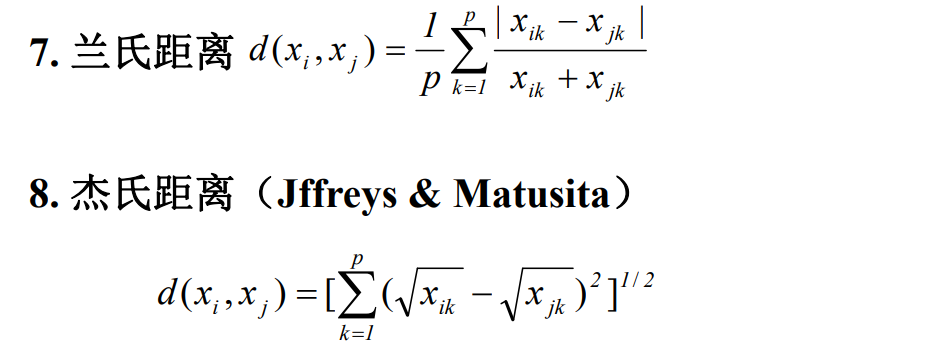
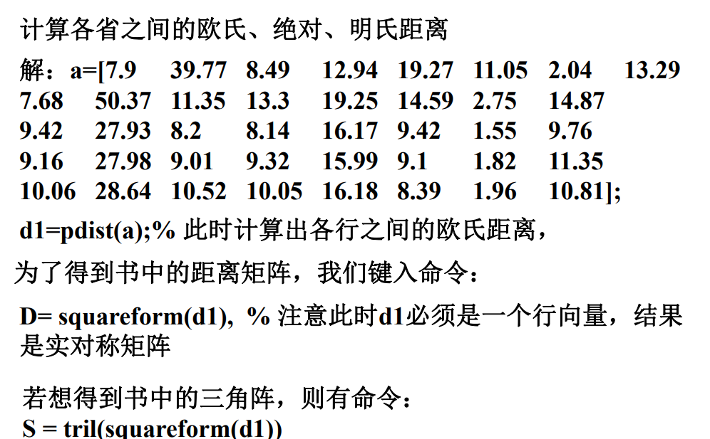

## 聚类分析  
### 什么是聚类分析  
1. 聚类是一个将数据集划分为若干组(class)或类(cluster)的过程，并使得同一组内的数据对象具有较高的相似度，而不同组不相似。  
2. 相似与否是基于数据描述属性的取值来确定的，通常利用各数据对象间的距离来进行表示。  
3. 聚类分析适用于探讨样本间相互关联关系从而对一个样本结构做一个初步的评价。  
4. 无监督学习。
5. 分为两种，Q型(核心)：对样品分类；R型：对变量(指标)分类，可以了解变量、变量组合间的亲疏程度，也即降维处理。  
### 样本间相似度的度量  
#### 1.距离
知道欧式距离就行。k维下每个维度上距离平方的根号求和。  
各距离及MATLAB命令  
  
  
例如：  
  
  
计算出各行间的距离后需转换成三角阵，便于查看两两间的距离。  
  
#### 2.相似系数  
用于对指标进行聚类。最常用的是相关系数和夹角余弦。相似系数需满足：  
  
1. 夹角余弦  
  
2. 相关系数  
  
二者MATLAB命令：  
  
***
### 谱系聚类法  
1. 步骤  
  
  
  
例子：  
  
  
注意，合并两类为新类时，更新新类与剩余类的距离的方式。即取最小类间距离。  
  
  
  
#### MATLAB命令  
1. 输入矩阵，用上述距离命令计算各样品间的距离。  
2. 选择类间距离进行聚类  
  
3. 根据类间距离做出谱系聚类图，并根据图得出聚类结果。  
  
例如：  
  
***
### K-评价聚类(k-means)  
1. 以k为参数，将n个对象分为k个簇，使得簇内对象具有较高的相似度。相似度的计算根据一个簇中对象的平均值(重心)。  
  
2. 特点  
+ 只适合聚类均值有意义的场合；
+ 用户须事先指定k的个数；
+ 对噪声和孤立点数据敏感，少量的该类数据能对聚类均值造成很大影响。  
#### k-means的优化  
1. 使用多次的随机初始化，计算每一次的代价函数值，取最小代价为类结果。  
2. 肘部分析法选择k的值：  
  
matlab代码：  

