## 灰色系统理论  
### 灰色系统应用范畴:  
+ 灰色关联度分析；
+ 灰色预测：人口、灾变等；
+ 灰色决策;
+ 灰色预测控制。  
### 灰色预测的概念  
+ 白色系统指其内部特征完全已知，系统信息完全充分。黑色是系统内部对外界而言是一无所知的。灰色系统内部的一部分信息是已知，系统内各因素间有不确定的关系。  
### 灰色预测法  
+ 灰色预测法对含有不确定因素的系统进行预测，对一定范围内变化的、与时间相关的灰色过程进行预测。  
+ 灰色预测通过鉴别系统因素之间发展趋势的相异程度，进行关联分析，对原始数据做生成处理寻找系统变动的规律，生成有较强规律的数据序列，然后建立相应的微分方程模拟，从而预测事物未来发展趋势的状况。  
### 灰色预测的四种类型  
1. 灰色时间序列预测  
用观察到的反映预测对象特征的时间序列来构造灰色预测模型，预测未来某一时刻的特征量，或达到某一量的时间；
2. 畸变预测  
通过灰色模型预测异常值出现的时刻。(异常气候、工厂设备异常时间)  
3. 系统预测(少用)  
通过对系统行为特征指标建立一组相互关联的灰色预测模型，预测系统中众多变量间的相互协调关系的变化。  
4. 拓扑预测  
原始数据做曲线，在其上按定值寻找该定值发生的所有时点，以该定值为框架构成时点数列，而后建立模型预测该定值所发生的时点。
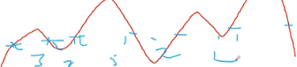  
红色为曲线，蓝色为定值。  
***
##  灰色关联度与优势分析  
1. 灰色关联度是分析向量间、矩阵间的关联度，需要计算某一个待比较的数列和参照物(参考数列)间的相关程度。  
### 基本步骤  
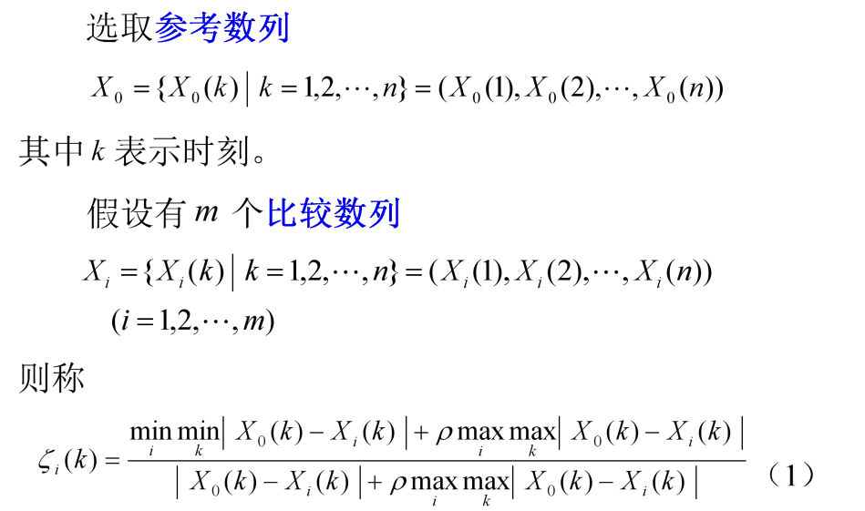  
>(1)式子也就是对于每一个比较数列的每一个k都有这一个值即每个i求n个。计算方式简言之为：[(参考数列的每个k减去第i个比较数列的每个k，里面的最小值)+ρ*(前括号相同计算方式下的最大值)]/(该k属性下，参考和比较的差值)+分子第二项；其实只需变分母的第一项，其余对每个i都是固定的。  

ρ是分辨系数，取值[0~1]，一般取0.5，越大分辨率越大，反之亦然。  
对上述每个i比较数列的n个值求平均，便是该比较数列i对参考数列的关联度。  
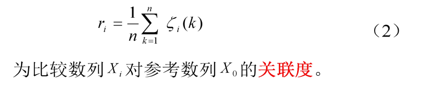  
对于正负关联的求取，需要符号函数sign(),用下面公式求得：  
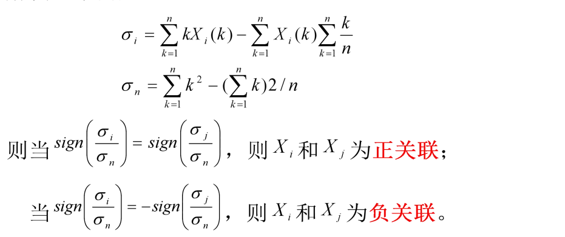  
### 例子  
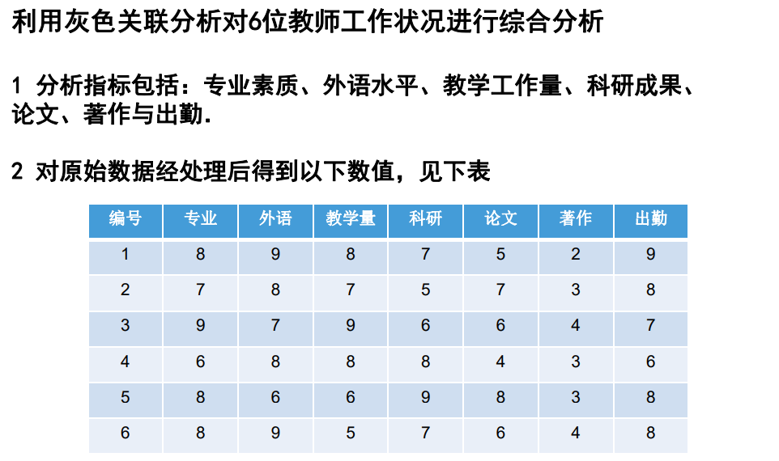
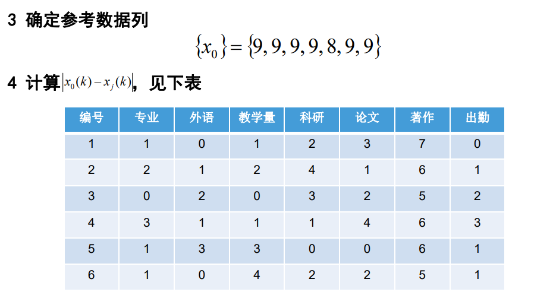
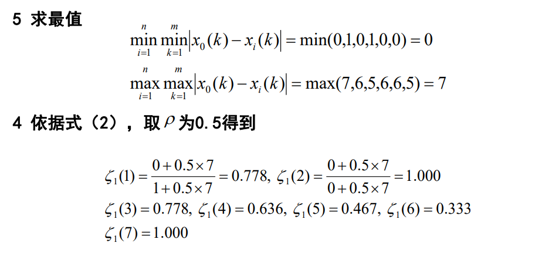
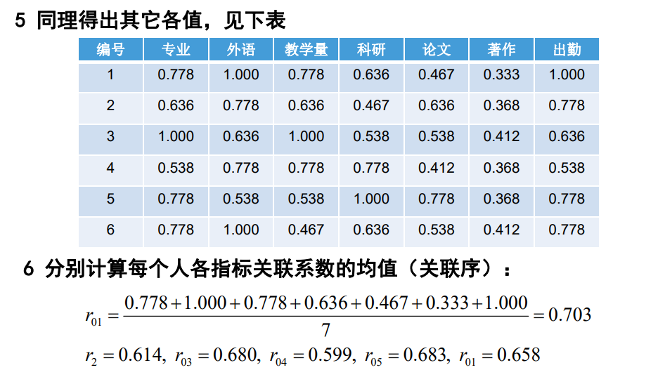  
***
## 灰色生成数列  
1. 灰色系统是通过对原始数据的整理来寻求其变化规律的，是一种就数据寻求数据的途径，这也就是灰色序列的生成。一切灰色序列都能通过某种生成弱化其随机性，显现他的规律性。数据生成常用方式有：`累加生成`、`累减生成`、`加权邻值生成`。  
## 灰色模型GM(1,1)  
### GM(1,1)的预测步骤  
1. 数据检验
GM(1,1)可行，建立在原始数列的数列级比都落在可覆盖区间内，如下：  
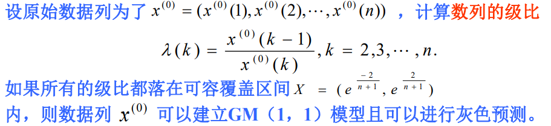  
也可对数列加减常树做平移变换使其级比落在可容覆盖内。  
2. 建立GM(1,1)模型  
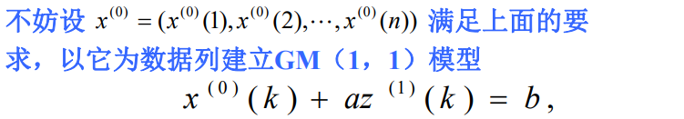  
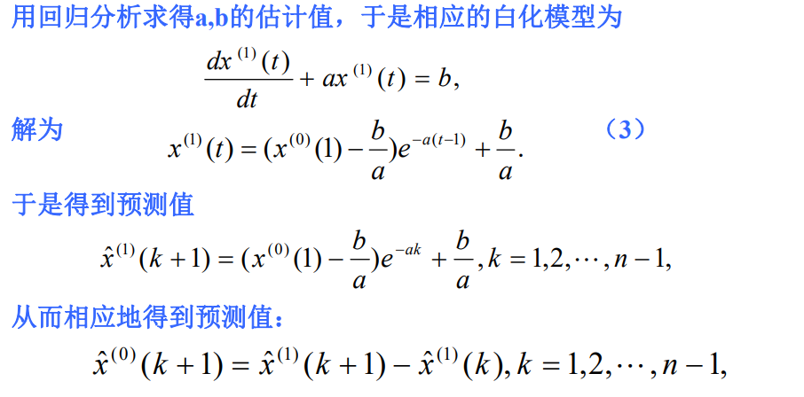  
3. 检验预测值  
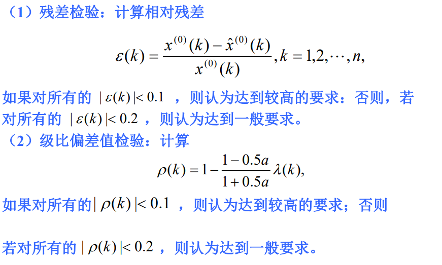  
### 实例  
1. 题  
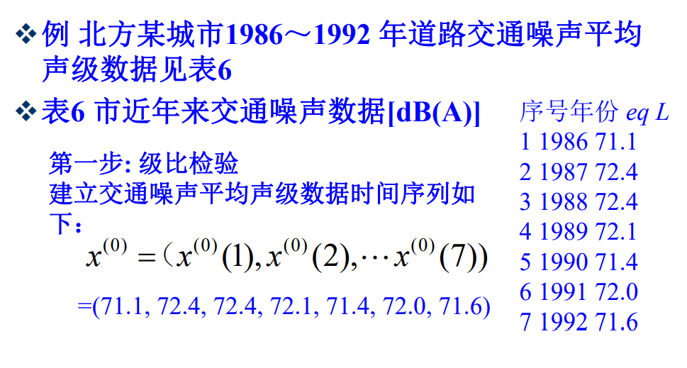  
2. 级比检验  
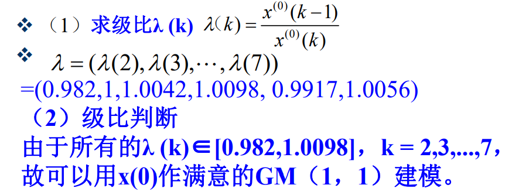  
3. GM(1,1)建模  
1）对原始数列做累加生成  
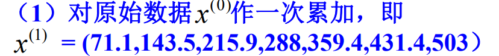
2）构造B矩阵，数据向量Y
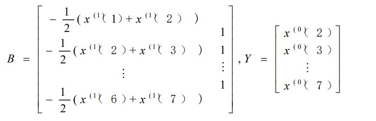  
3）计算u
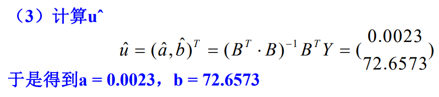  
4）建模  
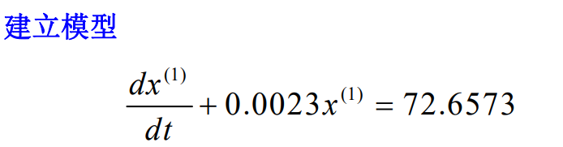
解得
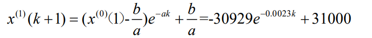
5）由上式求解生成数列值及模型的还原值
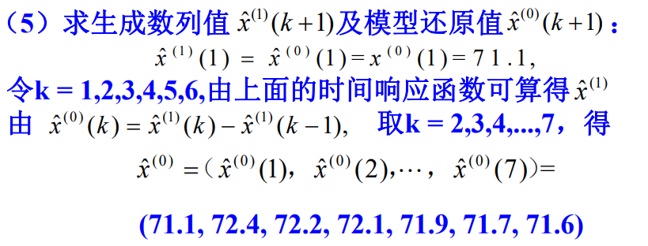
6）模型检验
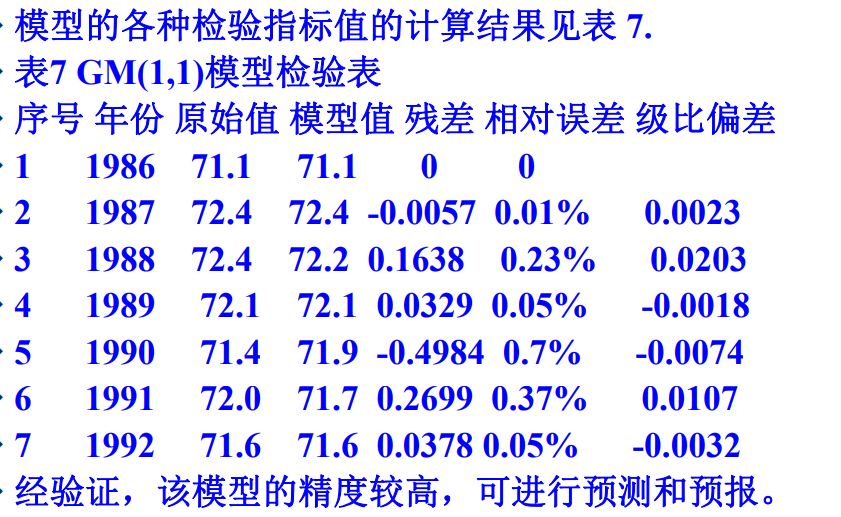  
### 代码样例(数据不同)  
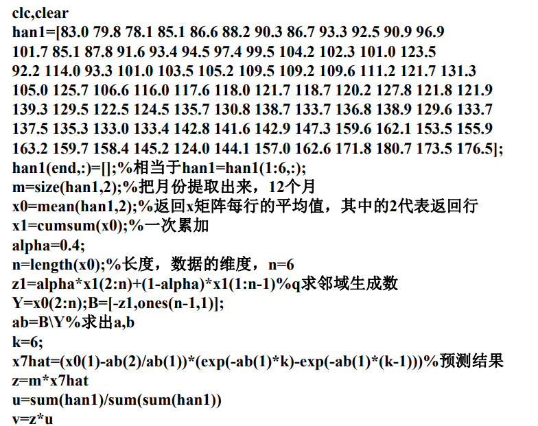  
注意求解a,b只需要命令B\Y(也就是B/Y)。

