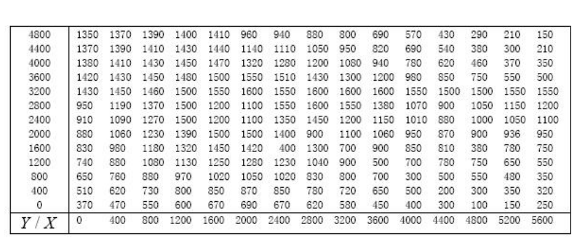

## 插值  
1. 插值问题  
已知函数在某区间内若干点处的值，求函数在该区间内其它点处的值。  
2. 注意避免龙格现象，插值函数最多不能高于七次。  
3. 使用线性累插避免，即将插值区间分成若干小区间，在小区间内用低次插值，即分段低次插值。  
### 一维插值  
  
  
### 二维插值  

  
### 例子  

  
  

 
 
#### 散乱点插值  
之前的(x,y)都是网格点，当其为散乱点时，使用命令griddata(x,y,z,xi,yi,'method)进行二维插值。  
例子：  
  
  
  
  
结果：  
  
