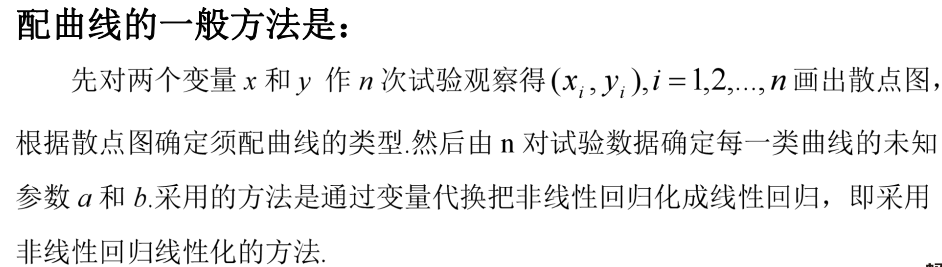
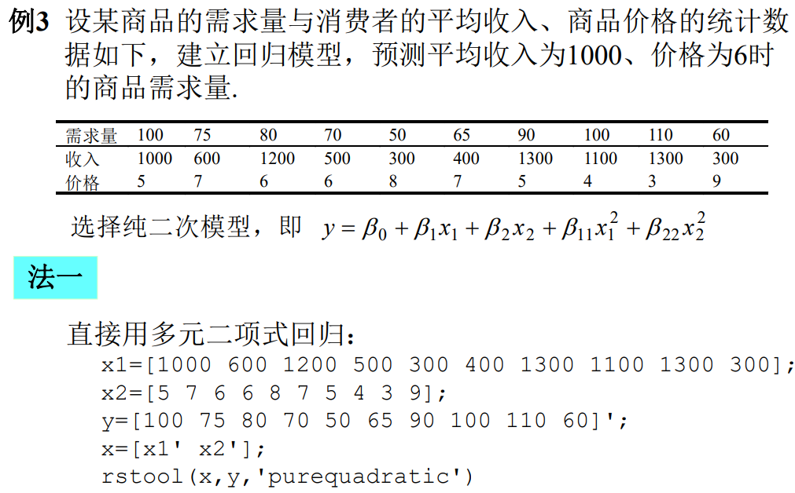

## 回归分析  
### 一元线性回归  
 
参数的计算由最小二乘法给出：  
  
显著性检验，  
  
检验方法：  
  

回归系数的置信区间：

1）预测：

2）控制：

### 一元非线性回归  
需要配曲线，通常选取六类曲线：

### 多元线性回归  
定义：

离差平方和对参数进行最小二乘估计：

多项式回归：

检验方法也是F检验和r检验。  
预测：

### 逐步回归分析  
  
### 回归分析的MATLAB命令  
1. 多元线性回归

2. 多项式回归

3. 多元二项式回归

4. 非线性回归

注意，需事先自己定义非线性函数。

5. 逐步分析

